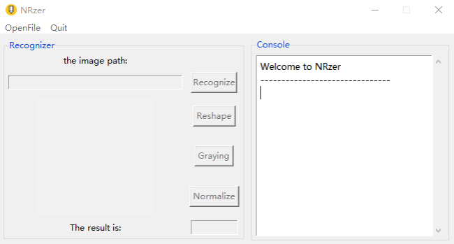
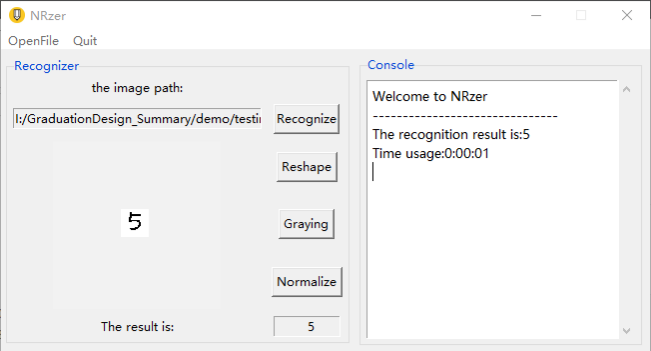

##A Handwritten Digit Recognition GUI System


## Description

- create_model.py - To train the LeNet-5 and save the model.
- main.py - The GUI system.
- tf_knn.py - Conduct KNN using Tensorflow
- tf_softmax.py - Conduct Softmax using Tensorflow
- use_model.py - Some useful function for main.py

## Get Started

1. Train the LeNet-5 and save the model.
2. Run the GUI system and start to play!

```
python create_model.py
python main.py
```





## Dependencies

- Windows or Linux
- GPU is not necessary, CPU is OK
- Tensorflow 1.X
- Python 2.7, 3.5 or 3.6

## Welcome to star and fork

It is a simple version. More details can be referred to: https://blog.csdn.net/louishao/article/details/60867339
